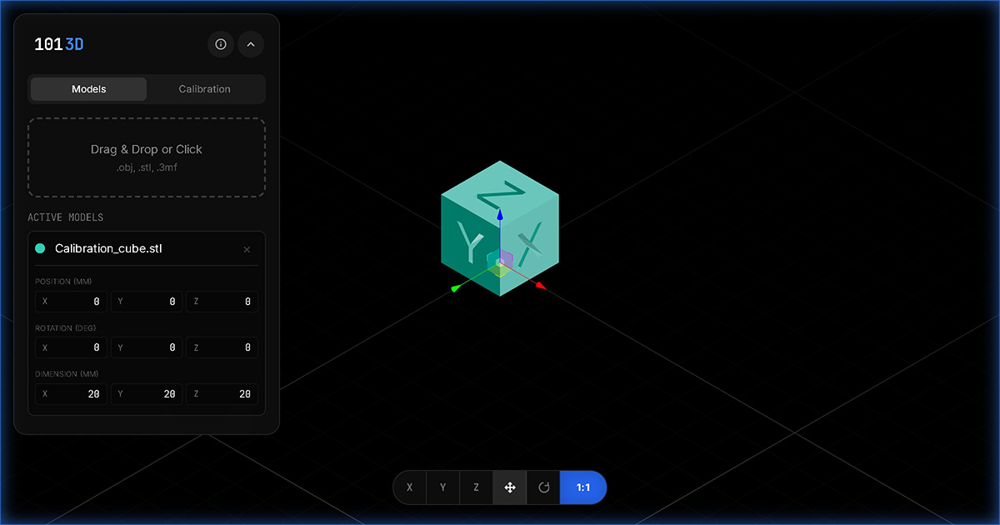

  

 

# 1013D - Precision 1:1 Scale & AR Engine

**Stop guessing scale. Verify your 3D prints at 1:1 physical size.**

[**Launch App**](https://1013d.pages.dev/)

---

## Introduction

**1013D** is a high-performance online 3D viewer designed for 3D printing enthusiasts and engineers. It solves the common problem of "scale anxiety" by allowing users to calibrate their screens to exact physical dimensions, enabling true **1:1 scale visualization** of STL, OBJ, and 3MF files before printing.

Beyond standard viewing, 1013D features a built-in **Augmented Reality (AR)** engine, allowing you to instantly project your models into the real world using iOS AR Quick Look or Android Scene Viewer.

## Key Features

- ** True 1:1 Physical Scale**
  Calibrate your specific monitor PPI (Pixels Per Inch) by typing your screen size or using a standard ID card (ISO 7810). Once calibrated, the object on your screen matches its exact real-world dimensions.

- ** Instant AR Preview**
  Generate AR-ready assets on the fly. View your 3D models in your actual environment on your mobile or VR headset.

- ** UI**
  A modern, immersive user interface featuring a minimal, true black background and colorful 3D model aesthetic that keeps the focus on your models.

- ** Broad Format Support**
  Native support for **STL**, **OBJ**, and **3MF** files.

## Tech Stack

Built with performance in mind using:
- **React** & **Vite**
- **Three.js** & **React Three Fiber** (WebGL 2.0)
- **Tailwind CSS**

## Author

[**Dexter Chock**](https://www.instagram.com/dexterchock)

---

  © 2026 1013D. All rights reserved.

